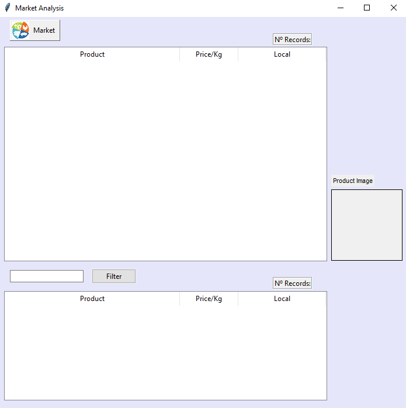
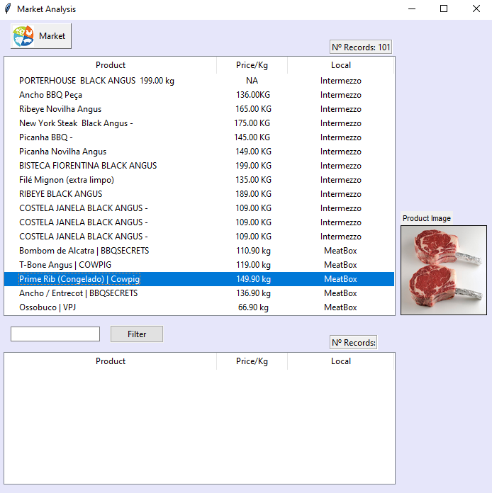
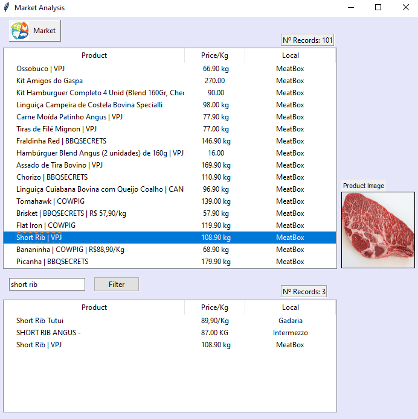

Market Analysis
-------------

Desktop Application to view prices of meat sold over the internet

----------------
The Project
-

The idea of this project is to analyze and evaluate the sale prices of pieces of meat in virtual stores. For previously registered locations, it is possible to evaluate prices of a product segment at any time. In this case, beef. This tool assists in data processing and facilitates visualization. It is still possible to filter specific products after all the data is in the base.

Dependencies
=
See "requirements.txt"

Screens
=
_Main Window_
-

_Request_                                                                                                          
=                                                                                                                          

After activating the searches, it is possible to view the location and sale price in addition to the respective image.
For this project, 3 companies were chosen.

_Filter_
=
It is possible to refine the search for specific products and thus make the visualization better.

Future Ideas
=
Implement new companies in addition to a statistics panel to monitor price fluctuations over time, average values and others. From this idea, it is possible to change the market type to other categories.
